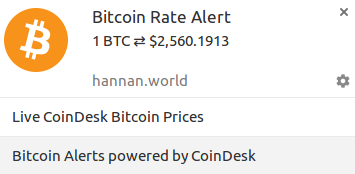

<!--
  What are my goals from this blogpost?
    I want to influence people to read about Push Notifications and using them in
    their applications. I also want to teach them about Web Push Protocol and how they 
    can quickly and easily send Push Notifications to a client using 
    Web Push Protocol in no time.

  What do I want to acheive using this blogpost?
    Starting to write is a big goal in itself and getting my work out in front of the 
    people and writing is a very big reward in itself.

  What are the type of people, I want this blogpost to read by?
  
  How are you going to form a story around this blogpost?
    I am writing this blogpost after working on a small Bitcoin Alerts project,
    so forming my story around Bitcoin Alerts, and using the Bitcoin Alerts makes sense
    in every way and I should probably do it. 

  Should this post guide the users to build an application or give a walkthrough 
  of the application Bitcoin Alerts we have been working on?

  Giving an introduction of the Web Push Notifications and the protocol.
  More about Web Push Protocol and implementing this in their applications, how they can do it.
  While not a full tutorial giving a sneak peak into how I do it with Bitcoin Alerts should 
  be enough to engage with users. 

  Title may be the very least thing, it doesn't help in any way to choose and work on the Title
  first.

  This can be more of a story on how I built this and how you can build this too.

  Structure of a blog post
  Might be one of the most important thing..

-->

# Building Bitcoin Alerts using Web Push

## Making the realtime possible

Push Notifications offers an instant way of communicating the updates to the users of an application, and they are popular for alerting people much faster than other mediums such as Chat or Email. Since, they work even if the user is not actively using your application and go right into the notification bar of your mobile phone so user is always more likely to see them, than some email which can probably go into their spam inbox too depending on what kind of things you are doing :speak_no_evil: . 

Push Notifications make the realtime possible by communicating about important events instantly. Mobile devices have limited battery and processing power, and Web Push Protocol makes this process efficient for your mobile application, so you don't have angry consumers complaining about your website, sucking all their battery.

Push Notifications had been missing from the Web for some time and in the past were only a previlige available to native mobile applications, those things you actually had to wait for to complete the installation and then use them. Progressive Web Applications are now getting more advanced features to enable native like experience on the Web, one popular example is of [Twitter Lite](https://mobile.twitter.com) which I use on daily basis.

Service Workers has enabled the offline applications to be a possibility on the web and has played a 
<!-- Huge role can be replaced with finally paved the way for push notifiations -->
huge role in making Push Notifications on the web possibility too. Push Notifications are now supported across major browsers, through [Web Push Protocol](https://tools.ietf.org/html/draft-ietf-webpush-protocol) standard.

<!--Excite the Users about the Protocol itself and write more about it-->
## Serious Protocol Talk

Web Push Protocol is an open standard desgined with the collaboration of major browser vendors and initially implemented by Firefox. Web Push is the most secure and reliable way to engage with your users in realtime and performs all the communication with browsers efficiently as compared to other alternatives such as Web Polling or WebSockets for occasional updates.

### Power consumption matters

Power consumption is not a major hurdle blocking the desktops to keep the webpages open, but things get serious when most of the people use your application on mobile. Instead of opening all these multi connections by keeping the webpages open, you can take advantage of one established connection and use it to deliver all the major updates to the device. So, no more angry users complaining about battery draining quickly cos they said yes to your notifications.

Being an open standard, Web Push Protocol actively discourages vendor lock in, as compared to some previous deprecated alternatives such as Google Cloud Messaging for outdated chrome browsers, Web Push Protocol doesn't require you to register with any operator to obtain an API key keeping the Web true to it's core and making the adoption much wider.

### Security and Identification

Open Web Standards, don't go very far in this day, if they are not secure. All the care is taken to make the communication secure and your data out of hands of haxors. Although, it's an open standard and a few things might vary from the browser to browser, you can disallow the vendors that don't implement Web Push Protocol spec properly as sufficient care might not have taken at their end to handle your data even if encrypted.

#### Identifying the Origin

Identifying that the request to trigger a push notification is coming from the right origin, get's a little complex if there's no dedicated registration authority. Web Push Protocol makes the identification process completely secure using [VAPID](https://tools.ietf.org/html/draft-thomson-webpush-vapid) a separate standard to securely identify trusted origins. This solves the problem of the Push notification requests coming from untrusted origins.

#### Payload Encryption 

Payload is the data you want your client to receive. Web Push Protocol doesn't allow unecrypted content by default, this step is taken so any irresponsible Push Services or other intermediaries can't read or manipulate the data you are sending, making sure the data is secure and unmodified when it reaches the user.

The two techniques used for the encryption of the payload are well known [ECDH and HKDF](https://developers.google.com/web/fundamentals/engage-and-retain/push-notifications/web-push-protocol#the_payload_encryption), you can read more about the Message Encryption process on the Google guide for [Web Push Protocol](https://developers.google.com/web/fundamentals/engage-and-retain/push-notifications/web-push-protocol#the_payload_encryption).

### Learn more about the protocol 

This is an over the top explanation about the Web Push Protocol. In order to learn more about the protocol and how of implementing it in your application. You should read the [Web Push Protocol guide]() by [@gauntface](https://twitter.com/gauntface) on Google Web Fundamentals. This gudie explains all the important concepts and is very helpful in implementing and understanding this protocol. 

## Building Bitcoin Alerts

Cryptocurrency is all the hype right now, Bitcoin, Dogecoin and a gazillion more. Therefore, I decided to build a simple solution to alert people about the latest exchange rate of Bitcoin to United States Dollar in real time.

The end goal was pretty simple for this application. User can subscribe for the push notifications by turning on the notifications and granting the required permissions to the user. Afterwards, we can go to the Admin page in order to trigger a Push Notification in the browser and a notification similar to the one shown below is displayed on desktop. 

This application was built to experiment with Web Push and is not intended for common users to use, as the Push Notifications are triggered manually using the [Bitcoin Alerts Admin Page](https://hannan.world/bitcoin-alerts), and based on the usage of the endpoint to trigger notification, somebody can trigger a bitcoin alert notification every second which is not quite ideal.

<!--Description about the Bitcoin Alerts Frontend-->
### How I built the application?

The Bitcoin Alerts first needed a way to subscribe to notifications and send this information to the server. In order to fulfil this requirement I built [Bitcoin Notifications Page](https://hannan.world/bitcoin-alerts) which is considered the main page, and is used to grant permissions to the application in order to subscribe to the Push Notification.

The source code for the Bitcoin Notification Page goes into [client/src/app]() directory and is repsonsible for handling the subscriptions of the user. This notification has a separate entrypoint within the application. The tasks of this notification page also include registering a [service worker]() which is required to register for Push Notifications.

Service Worker within this applicaiton is kept simple and handles Push Notification specific events in ServiceWorker related to Push Notifications such as `push` and `pushsubscriptionchange`. Whenever the client receives a push notification, the `push` event is called and Notification is shown using the data that comes with this event.

Bitcoin Alerts also contains an admin page, which is used to trigger the notifications, as there's no other event based mechanism we can use to trigger notification. This page makes a request to the Custom App Backend Server, which triggers a Push Notification either for a specific Subscriber using it's Server ID, or for all the subscribers that are in the database.

Server Side of the Bitcoin Alerts is used to store subscriptions as well as send Bitcoin Alert Push Notifications to these subscriptions. After a push notification is requested, all the subscribers stored are retrieved, along with the latest Bitcoin exchange rate using very helpful [CoinDesk API](www.coindesk.com/api/). Now, we have all the things we need to send a Push Notification to the user, so we use the [web-push](https://github.com/web-push-libs/web-push) lib in order to send the Push Notifications using Web Push protocol without the hassle of implementing all the inner details of WebPush Protocol ourselves.

#### About the Code

I have detailed all the flow our application goes through above. If you would like to take a look on the code yourselves, feel free to check out the [Github Repository](github.com/abdulhannanali/bitcoin-alerts/) for Bitcoin Alerts. This repository contains the code for the Client Side as well as Server Side of the application, along with all the details on how to deploy and run your own version of the application. 

Thank you for giving this a read. I appreciate it very much.  

<!-- 
  Tell about my feelings of reading through the standard documents, is it misleading and ruining the focus of users, probability is they don't care a lot for my feelings about the Push Notificiations
  This can come but at the end, no harm maybe.
-->

If you haven't read a standards document ever before, they are worth reading, as I have come to know through reading about Web Push.

<!--Add information here about Service Worker instead of Progressive Web Applications